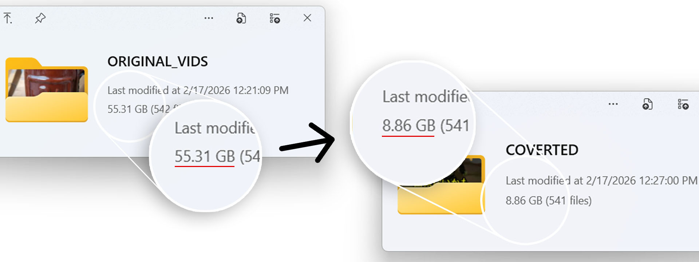

# 📦 batch-video-downsizer (GitBash script)


Want to backup your videos for all those noslagic memories?
Your out of luck cause those videos takes so much space. Luckily I made a tool for batch reducing the file size so you don't have to do each one manually!

## Example conversions

| File name        | Format (codec)        | Original resolution           | → | Converted resolution | Output file name     | Output format (codec) |
|------------------|-----------------------|-------------------------------|---|----------------------|----------------------|------------------------|
| sample1.mp4     | MP4 (H.264)          | 3840×2160 (Landscape)        | → | 1920×1080           | v1080_sample1.mp4   | MP4 (H.264)           |
| sample2.mp4     | MP4 (H.265 / HEVC)   | 2560×1440 (Landscape)        | → | 1792×1008           | v1080_sample2.mp4   | MP4 (H.264)           |
| sample3.mp4     | MP4 (H.264)          | 1920×1080 (Landscape)        | → | 1344×756            | v1080_sample3.mp4   | MP4 (H.264)           |
| sample4.mp4     | MP4 (H.264)          | 1280×720 (Landscape)         | → | 1280×720            | v1080_sample4.mp4   | MP4 (H.264)           |
| sample5.mp4     | MP4 (H.264)          | 900×720 (Landscape)          | → | 1280×720            | v1080_sample5.mp4   | MP4 (H.264)           |
| sample6.mov     | MOV (ProRes)         | 640×480 (Landscape)          | → | 1280×720            | v1080_sample6.mp4   | MP4 (H.264)           |
| sample7.mkv     | MKV (VP9)            | 1080×1920 (Portrait)         | → | 756×1344            | v1080_sample7.mp4   | MP4 (H.264)           |
| sample8.mov     | MOV (H.264)          | 1440×2560 (Portrait)         | → | 1008×1792           | v1080_sample8.mp4   | MP4 (H.264)           |
| sample9.mp4     | MP4 (H.265 / HEVC)   | 2160×3840 (Portrait)         | → | 1080×1920           | v1080_sample9.mp4   | MP4 (H.264)           |
| sample10.mkv    | MKV (AV1)            | 720×1280 (Portrait)          | → | 720×1280            | v1080_sample10.mp4  | MP4 (H.264)           |
| sample11.mp4    | MP4 (H.264)          | 480×854 (Portrait)           | → | 720×1280            | v1080_sample11.mp4  | MP4 (H.264)           |
| sample12.mov    | MOV (DNxHD)          | 320×240 (Landscape)          | → | 1280×720            | v1080_sample12.mp4  | MP4 (H.264)           |


## ⚠️ Caution
I currently use gitbash on windows with ffmpeg.
before continuing, setup gitbash and download ffmpeg.
Future commits might include a dedicated script for linux or windows.

## The script
Copy and paste this on your windows gitbash terminal. Make sure to open the current directory contains all the video files you want to downsize.
### CPU intensive (SLOW)
```bash
mkdir -p ORIG_FILES CONVERTED_FILES && for f in *.mp4 *.MP4 *.mov *.MOV .*.mp4 .*.MP4 .*.mov .*.MOV *.mkv; do [ -e "$f" ] || continue; ctime=$(ffprobe -v quiet -show_entries format_tags=creation_time -of default=nw=1:nk=1 "$f"); ffmpeg -i "$f" -vf "scale='trunc(max(min(iw*0.7,if(gt(iw,ih),1920,1080)),if(gt(iw,ih),1280,720))/2)*2':'trunc(max(min(ih*0.7,if(gt(iw,ih),1080,1920)),if(gt(iw,ih),720,1280))/2)*2':flags=lanczos" -c:v libx264 -crf 23 -preset slow -c:a copy -metadata creation_time="$ctime" "CONVERTED_FILES/v1080_${f%.*}.mp4" && mv "$f" ORIG_FILES/; done
```
### NVIDIA GPU ACCELERATED (FAST)
```bash
mkdir -p ORIG_FILES CONVERTED_FILES && for f in *.mp4 *.MP4 *.mov *.MOV .*.mp4 .*.MP4 .*.mov .*.MOV *.mkv; do [ -e "$f" ] || continue; ctime=$(ffprobe -v quiet -show_entries format_tags=creation_time -of default=nw=1:nk=1 "$f"); ffmpeg -hwaccel cuda -i "$f" -vf "scale='trunc(max(min(iw*0.7,if(gt(iw,ih),1920,1080)),if(gt(iw,ih),1280,720))/2)*2':'trunc(max(min(ih*0.7,if(gt(iw,ih),1080,1920)),if(gt(iw,ih),720,1280))/2)*2',format=yuv420p" -c:v h264_nvenc -preset p6 -rc vbr -cq 28 -c:a copy -metadata creation_time="$ctime" "CONVERTED_FILES/v1080_${f%.*}.mp4" && mv "$f" ORIG_FILES/; done
```

# Feature list
- Supports .mp4, .MP4, .mov, .MOV, .mkv, including hidden files
- Automatically detects portrait and landscape orientation
- Applies proportional downscaling (70%) to reduce file size efficiently
- Ensures output dimensions are even numbers for codec compatibility
- Encodes video with H.264 (libx264) for maximum compatibility
- Uses slow preset for improved compression efficiency
- Copies audio stream without re-encoding to preserve quality and speed
- Preserves original media creation timestamp metadata
- Automatically prefixes output filenames with v1080_
- Moves original files into ORIG_FILES after successful conversion
- Saves converted files into CONVERTED_FILES for clean organization
- Skips processing safely if no matching files exist
- Fully automated one-line command, no manual input required


